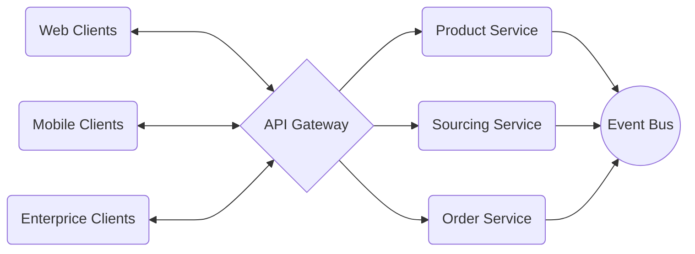

# AuctionHouse

	    Technologies:
	    - ".NET 7"
	    - "Entity Framework Core with Code First Approach"
	    - "SQL Server"
	    - "MongoDB"
	    - "RabbitMQ"
	    - "SignalR"
	    - "API Gateway Design Pattern with Ocelot"
	    - "Polly Framework"
	    - "Docker and Docker Compose"
	      
	    Architecture and Design Patterns:
	    - "Microservices Architecture"
	    - "Clean Architecture"
	    - "CQRS"
	    - "MediatR"
	    - "Cross Cutting Concerns"
	    - "N-Layer Project"
	    - "Repository Design Pattern"
	    - "SOLID Principles"
	    - "Web Socket Programming with SignalR"
	    
	    API Gateway:
	    - "Ocelot API Gateway Framework"
	    - "Ocelot Routing, Upstream, Downstream on Configuration File"
	    - "Docker-Compose Implementation"
	    
	    Product Microservice:
	    - "Rest API Principles / CRUD Operations"
	    - "MongoDB (NoSQL) Implementation on Docker"
	    - "N-Layer Project"
	    - "Docker-Compose Implementation"
	    
	    Sourcing Microservice:
	    - "Rest API Principles / CRUD Operations"
	    - "MongoDB (NoSQL) Implementation on Docker"
	    - "N-Layer Project"
	    - "SignalR Implementation"
	    - "Docker-Compose Implementation"
	    
	    Order Microservice:
	    - "SQL Server Implementation on Docker"
	    - "Entity Framework Core with Code First Approach"
	    - "Clean Architecture Implementation"
	    - "CQRS Implementation with MediatR Pattern"
	    - "RabbitMQ Consumer Implementation"
	    - "Docker-Compose Implementation"
	    
	    Containers on Docker:
	    - "SQL server"
	    - "MongoDB"
	    - "RabbitMQ"
	    - "API Gateway"
	    - "Web Application"
	    - "Product Microservice"
	    - "Sourcing Microservice"
	    - "Order Microservice"
